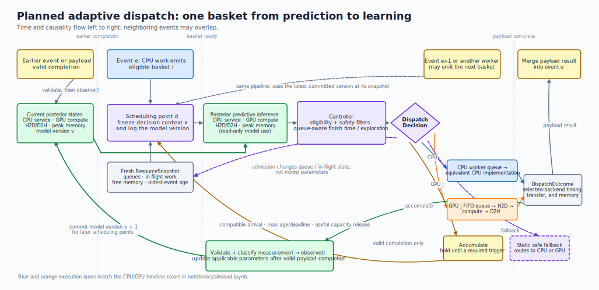

# Adaptive Bayesian CPU/GPU Dispatch Study

## Status

This document is the canonical plan for the adaptive scheduling R&D study. Keep implementation
decisions, acceptance criteria, and future revisions synchronized with this file.

## 1. Goal and research hypothesis

The study will determine whether a small, continuously updated probabilistic performance model can
increase the stable throughput of a Geant4-like simulation job running on an exclusively allocated
multi-CPU, multi-GPU node.

The operational goal is:

> Maximize stable simulation throughput by dynamically batching and routing semantically
> GPU-eligible work across the CPU worker pool and available GPUs, while bounding event-tail
> latency, queue growth, memory risk, correctness risk, and scheduler overhead.

CPU and GPU saturation are diagnostics and desirable consequences, not the objective itself.
Maximizing utilization without constraints can create an unstable GPU queue, retain event state for
too long, and increase memory pressure. The current Simload comparison demonstrates this tradeoff:
asynchronous execution reaches roughly 87% CPU/GPU timeline occupancy and 0.60 events/s, but its
deferred collection also produces an approximately 27-second p95 event residence. The study must
therefore optimize constrained throughput, not utilization at any cost.

The primary hypothesis is that a dynamic linear Kalman filter, initialized from Bayesian regression
priors, can:

1. start from deliberately weak priors learned from Simload and compatible historical jobs;
2. calibrate itself from measurements produced by the current job;
3. explicitly track uncertainty and performance drift;
4. drive a constrained earliest-finish scheduler; and
5. safely collect additional information through conservative online exploration.

The study remains application-neutral at its interfaces. Its main application mapping is a
Geant4-style multithreaded process in which independent event workers generate baskets of
GPU-eligible tracks. The HPC batch scheduler and inter-node placement are outside the first study;
the adaptive scheduler operates inside one allocated job.

## 2. Important correction to the current Simload interpretation

The current `simload` workflow models CPU work and GPU work as mandatory, complementary stages of an
event. Its sampled `cpu_fraction` and `gpu_fraction` are workload-generation inputs, not observed
evidence that a payload should be routed to one resource or the other.

Consequently:

- the existing data can compare synchronization policies and measure overlap, queueing, waiting,
  makespan, and event residence;
- it cannot train a valid CPU-versus-GPU routing model for interchangeable work;
- `cpu_fraction` must not be used as a routing target or predictive input; and
- the routing study must introduce a common payload with semantically equivalent CPU and GPU
  implementations.

The existing synchronization experiment and output schema should remain supported. The new routing
workflow will be opt-in and will generate decision-level and completion-level records in addition
to event summaries.

## 3. What is predicted and what is decided

### 3.1 Hard application rules

The learned model will not determine whether arbitrary physics code is GPU-compatible. A backend
adapter must declare:

- whether a payload kind is CPU-only or CPU/GPU eligible;
- which CPU and GPU implementations are semantically equivalent;
- resource and memory invariants that must never be violated; and
- how equivalence and physics correctness are validated.

Only payloads with verified alternative implementations enter the learned routing action space.

### 3.2 Bayesian prediction targets

Let $i$ identify a candidate basket, $d$ identify a scheduling decision made at wall-clock time
$\tau_d$, and $r$ identify a candidate execution resource. Let $b_i$ be the basket's immutable
descriptor and $s_{\tau_d}$ the fresh `ResourceSnapshot`. The **decision-time context**

$$
x_{i,r}^{(d)} = g(b_i, r, s_{\tau_d})
$$

is the frozen, target-specific feature vector available before an action is selected. It can contain
the workload kind, item count, byte volumes, bounded complexity and batch features, event age, and
applicable active-load covariates. It must not contain the selected action's outcome or telemetry
observed later. The complete resource snapshot remains available to the controller; in particular,
queued work is used to derive queue delay rather than being learned as an intrinsic basket property.

Let

$$
D_{\tau_d}
=
\left\{
\left(x_e, a_e, o_e\right)
:
o_e\text{ was validated and incorporated by }\operatorname{observe}\text{ before }\tau_d
\right\}
$$

be the accumulated real-job evidence available to the model at that decision. Here $a_e$ is the
selected action and $o_e$ its measured `DispatchOutcome`; simulator and compatible historical
evidence are represented by the prior. In-flight, rejected, or not-yet-incorporated outcomes are
not in $D_{\tau_d}$. Thus, $x_{i,r}^{(d)}$ is the **current prediction query**, whereas
$D_{\tau_d}$ is the **past evidence already used to fit the posterior**. These are the precise
forms of the earlier shorthand $x_i$ and $D_t$.

Maintain four named posterior predictive distributions:

$$
\mathcal{P}_{i,d}^{\mathrm{cpu}}
:=
p\!\left(
T_{\mathrm{cpu},i}
\mid x_{i,\mathrm{cpu}}^{(d)}, D_{\tau_d}
\right)
$$

$$
\mathcal{P}_{i,r,d}^{\mathrm{compute}}
:=
p\!\left(
T_{\mathrm{gpu-compute},i,r}
\mid x_{i,r}^{(d)}, D_{\tau_d}
\right)
$$

$$
\mathcal{P}_{i,r,d}^{\mathrm{transfer}}
:=
p\!\left(
T_{\mathrm{h2d},i,r}
\mid x_{i,r}^{(d)}, D_{\tau_d}
\right)
\times
p\!\left(
T_{\mathrm{d2h},i,r}
\mid x_{i,r}^{(d)}, D_{\tau_d}
\right)
$$

$$
\mathcal{P}_{i,r,d}^{\mathrm{memory}}
:=
p\!\left(
M_{\mathrm{gpu-peak},i,r}
\mid x_{i,r}^{(d)}, D_{\tau_d}
\right)
$$

The direct posterior summaries map to those names as follows:

- $\mathcal{P}^{\mathrm{cpu}}$ supplies CPU service-time means, intervals, and quantiles.
- $\mathcal{P}^{\mathrm{compute}}$ supplies GPU compute-time means, intervals, and quantiles;
  $\mathcal{P}^{\mathrm{transfer}}$ supplies the corresponding H2D and D2H summaries. Samples from
  all three GPU components form the total GPU service-time distribution.
- $\mathcal{P}^{\mathrm{memory}}$ supplies peak-memory quantiles and the probability of exceeding
  the safe allocation.

Other scheduler quantities are **derived from**, rather than additional members of, the four
named distributions:

- Batch-size response, crossover, and diminishing returns come from reevaluating the named
  distributions for alternative candidate basket sizes.
- CPU-versus-GPU finish probabilities also include accumulation and predicted queued service. For
  example, relative to $\tau_d$,

  $$
  F_{i,\mathrm{cpu}}^{(d)}
  =
  W_{\mathrm{cpu}}^{(d)} + T_{\mathrm{cpu},i}
  $$

  $$
  F_{i,r}^{(d)}
  =
  A_{i,r}^{(d)} + W_r^{(d)}
  + T_{\mathrm{h2d},i,r}
  + T_{\mathrm{gpu-compute},i,r}
  + T_{\mathrm{d2h},i,r},
  $$

  where $A_{i,r}^{(d)}$ is any proposed accumulation delay and $W_r^{(d)}$ is the delay derived
  from work already admitted ahead of the basket. The controller compares samples to estimate
  $\Pr(F_{i,r}^{(d)} < F_{i,\mathrm{cpu}}^{(d)})$.
- Out-of-distribution or insufficient-evidence status is a feature-support and uncertainty
  diagnostic, not a fifth predictive distribution.

The initial implementation maintains separate H2D and D2H model states and constructs
$\mathcal{P}^{\mathrm{transfer}}$ using conditionally independent residual draws given the frozen
context and current model state. If paired measurements show material residual covariance, the
transfer model must represent it explicitly. Finish-time comparisons must likewise record the
dependence assumptions used to compose their posterior samples.

Queue delay is not trained as if it were an intrinsic payload property. The controller derives
expected queue delay from the queued work and predicted service distributions. This avoids teaching
the performance model policy-dependent behavior.

### 3.3 Scheduling decisions

A scheduling decision applies only to uncommitted eligible work. It occurs after one or more
compatible candidate baskets have been formed and a fresh resource snapshot has been captured,
immediately before the selected basket would be admitted to the CPU worker queue or a particular
GPU's FIFO queue. At that point the controller takes a consistent model version, freezes and logs
$x_{i,r}^{(d)}$ for every candidate resource, runs inference, filters and scores the actions, and
commits a `DispatchDecision`.

The controller is invoked when:

1. an event worker emits eligible items that create or change a ready basket;
2. compatible items arrive for a basket being accumulated;
3. an accumulation deadline, oldest-event limit, or backpressure limit requires reconsideration;
   or
4. a completion releases capacity and, after any valid model update, pending work can usefully be
   reconsidered.

Choosing `accumulate` is nonterminal: it must establish a mandatory reconsideration deadline, and
the held work re-enters the controller on a compatible arrival, that deadline, or a useful capacity
change. A completion with no ready or held work updates telemetry and possibly the model, but does
not create a scheduling decision. Already admitted or running work is not migrated in the first
study.

After a selected implementation completes, processing is ordered as: record and validate the
`DispatchOutcome`, call `observe()` for a valid measurement, commit the applicable parameter
update, capture a fresh resource snapshot, and then reconsider pending work. Consequently, a
completion can affect only later scheduling decisions. Event start, GPU start, and whole-event
merge are not model-update points.

In the new routing workflow, the initial decision boundary occurs when an event worker exposes a
semantically equivalent CPU/GPU payload—analogous to the end of the current basket-forming CPU
phase, but not determined by the sampled `dispatch_fraction`. It need not occur exactly once per
event: one event may emit several baskets, while one accumulated basket may contain items from
several events.

The controller combines predictions with current resource and event state to choose:

- execute on the CPU worker pool;
- dispatch the current basket to GPU $j$;
- temporarily accumulate more compatible items for a larger GPU basket; or
- fall back to the configured static safe policy.

The model does not directly predict a global CPU/GPU percentage. The observed distribution emerges
from individual constrained decisions and changes with workload composition, queue state, batch
efficiency, and hardware performance.

A direct best-action classifier is also deliberately avoided. The current Simload CPU/GPU fractions
are generated workload assumptions, not counterfactual routing labels, and a classifier trained on
them would become invalid as queues, devices, batch formation, and scheduling policies change.

### 3.4 Single-event decision and learning loop

The following planned-workflow diagram extends the notebook's left-to-right CPU/GPU timeline
vocabulary. It follows one eligible basket while showing the earlier completion that supplied the
current posterior and a later event that reuses the same scheduling pipeline.

[](figures/adaptive-dispatch-event-loop.svg)

*Figure 1. Inference is a read-only use of the posterior and resource state at a scheduling point.
Dispatch changes admission, queue, and in-flight state but not model parameters. `observe()` updates
the applicable parameters only after a valid selected-backend payload completion; event merge does
not gate learning.*

The event labels illustrate causality, not serialized execution. Events and payload completions are
asynchronous, so a later basket uses whichever committed model version exists when it captures its
snapshot; it does not wait for event $e$ to finish. Only the selected backend produces an outcome.
The [figure-generation source](figures/render_adaptive_dispatch_architecture.py) uses the same blue
CPU and orange GPU colors as the existing notebook visualization.

## 4. Bayesian performance model with online Kalman updates

The performance model has two connected stages. Before a job, Bayesian linear regression turns
simulator measurements and compatible historical data into deliberately broad priors. During the
job, a linear Kalman filter updates those priors after each valid completion and allows selected
run- and device-specific coefficients to evolve. These are not competing model choices: the
Bayesian regression establishes the initial uncertainty, while the Kalman formulation provides the
sequential, drift-aware update used by the scheduler.

### 4.1 Observation model

Let $k$ index valid outcome measurements in the order accepted by the applicable model state. This
is distinct from decision index $d$ because decisions and completions are asynchronous. At update
$k$, $x_k$ is the exact target-specific context frozen and logged at the originating decision; it
must not be recomputed from the resource state observed at completion.

Each positive timing or memory target is modeled in log space:

$$
y_k = \log z_k = \phi(x_k)^\mathsf{T}\theta_k + v_k, \qquad
v_k \sim \mathcal{N}(0, R_k)
$$

where:

- $z_k$ is a measured service time, transfer time, or memory peak;
- $\phi(x_k)$ is a bounded feature basis computed from decision-time information;
- $\theta_k$ contains performance coefficients; and
- $R_k$ is observation-noise variance for the applicable payload/resource model.

The feature basis should initially include:

- intercept;
- workload-kind indicators;
- `log1p(item_count)`;
- `log1p(input_bytes)` and `log1p(output_bytes)`;
- `log1p(working_set_bytes)`;
- bounded application-provided complexity features;
- batch-size linear and hinge terms for saturation behavior;
- active CPU workers or per-device in-flight work;
- recent resource-load summaries; and
- interactions selected in advance, such as workload kind by batch size.

Nonlinear behavior is represented through transformed features while the model remains linear in
its parameters. An extended or unscented Kalman filter is therefore not required for the first
study.

### 4.2 Prior construction with Bayesian regression

Use Bayesian linear regression with a Normal-Inverse-Gamma prior for each prediction target and
payload/resource class:

$$
\theta \mid \sigma^2 \sim \mathcal{N}(m_0, \sigma^2 P_0)
$$

$$
\sigma^2 \sim \operatorname{InvGamma}(a_0, b_0)
$$

This stage supplies:

- a prior coefficient mean $m_0$;
- conditional coefficient covariance scale $P_0$;
- an observation-noise estimate;
- posterior predictive Student-t intervals; and
- a compact set of sufficient statistics that can be persisted without retaining every raw event.

At deployment, the regression posterior initializes the Kalman coefficient mean and covariance;
its posterior noise estimate initializes the observation-noise model. Batch regression remains the
reference calculation for validating the sequential implementation.

Simulator data must become a weak prior rather than being pooled equally with real measurements.
Cap the simulated contribution at 20 real-equivalent observations per payload/resource model and
inflate its covariance. Real-job measurements should be able to override simulator assumptions
quickly.

A compatible historical-job posterior may refine the shared prior, but compatibility must be keyed
by:

- payload-schema and workload-kind versions;
- CPU and GPU hardware classes;
- kernel/backend version;
- geometry and physics configuration;
- compiler, driver, and numerical runtime versions; and
- model feature-schema version.

Incompatible configurations start a new model lineage or fall back to a broader hardware/workload
prior.

Maintain separate compact model states for CPU service, GPU compute, each transfer direction, and
peak memory. Partially pool structural coefficients where payload kinds, resource classes, and
hardware classes have a defensible common relationship. Identical GPUs share a hardware-level base
model but retain their own run- and device-specific calibration state.

### 4.3 Online Kalman filtering

Online operation uses a linear Kalman-filter interpretation of sequential Bayes:

$$
\theta_k = F_k\theta_{k-1} + w_k,
\qquad
w_k \sim \mathcal{N}(0, Q_k)
$$

For the initial implementation, $F_k = I$. The predicted coefficient distribution is:

$$
m_k^- = m_{k-1}
$$

$$
P_k^- = P_{k-1} + Q_k
$$

Given feature vector $\phi_k$ and completed measurement $y_k$:

$$
S_k = \phi_k^\mathsf{T}P_k^-\phi_k + R_k
$$

$$
K_k = P_k^-\phi_k S_k^{-1}
$$

$$
m_k = m_k^- + K_k(y_k - \phi_k^\mathsf{T}m_k^-)
$$

$$
P_k = (I - K_k\phi_k^\mathsf{T})P_k^-
$$

The resulting posterior $\mathcal{N}(m_k, P_k)$ becomes the prior for the next observation.
With $Q_k=0$ and known $R_k$, this is mathematically equivalent to sequential Gaussian
Bayesian linear regression and recursive least squares. For scheduling, combine parameter
uncertainty $\phi_k^\mathsf{T}P_k\phi_k$ with observation noise $R_k$, then transform predictive
samples from log space back to physical time or memory units. This preserves the asymmetric
uncertainty that matters for finish-time and memory-risk decisions.

The first implementation should use NumPy operations on these small state vectors and matrices; it
does not require a heavyweight probabilistic framework.

### 4.4 Structural and calibration parameters

Partition the coefficients conceptually into:

$$
\theta_k =
\begin{bmatrix}
\theta_{\mathrm{structural},k} \\
\theta_{\mathrm{calibration},k}
\end{bmatrix}
$$

Structural coefficients describe relationships such as scaling with payload size, transfer volume,
and batch size. Calibration coefficients describe the current run or device, including speed
offset, contention sensitivity, thermal effects, and other short-term changes.

Configure block-diagonal process noise:

$$
Q =
\begin{bmatrix}
Q_{\mathrm{structural}} & 0 \\
0 & Q_{\mathrm{calibration}}
\end{bmatrix}
$$

with:

- near-zero process noise for shared structural coefficients;
- small process noise for stable device-class coefficients; and
- larger process noise for run- and device-specific calibration coefficients.

This preserves knowledge learned across jobs while allowing current performance to move. Initial
values of $Q$ should be derived from repeated-run variance in the simulator and calibration data,
then tuned only on training scenarios.

### 4.5 Observation noise and robust updates

Observation noise is initially estimated by the Normal-Inverse-Gamma regression. During operation:

- update $R$ from a bounded exponentially weighted innovation statistic;
- maintain separate noise estimates by target, workload kind, and resource class;
- apply an innovation gate before updating;
- classify initialization, telemetry failure, allocation retry, and preemption measurements
  separately from normal service observations; and
- use Student-t-inspired robust weighting or a variance-inflated Kalman update for valid but
  extreme observations.

Discarding an observation should require an explicit invalid-measurement reason. Slow but valid
payloads must remain in the dataset because they are important to scheduling.

### 4.6 Drift and posterior reuse

Track normalized innovation:

$$
\eta_k = \frac{y_k-\phi_k^\mathsf{T}m_k^-}{\sqrt{S_k}}
$$

Use sustained innovation bias, interval-coverage degradation, or a version change to identify
drift. On drift:

- increase process noise for the affected calibration block;
- reset an affected device- or run-specific intercept when necessary;
- retain compatible structural coefficients;
- stop exploratory decisions if calibration becomes unreliable; and
- use the static baseline until uncertainty returns to a safe range.

Do not carry an increasingly concentrated posterior forward indefinitely without process noise or
covariance inflation. That would make the model overconfident and unable to adapt.

### 4.7 Delayed and out-of-order outcomes

Decisions and completions are asynchronous. Every observation must retain decision time, execution
start time, completion time, model version, and the exact feature vector used for prediction.

- Structural updates with zero process noise are order-insensitive.
- Device calibration updates should be applied per device in execution-time order.
- Late observations produced under an older model remain valid measurements, but must update the
  applicable payload/resource state rather than being treated as if generated by the newest
  decision context.

## 5. Scheduler and conservative exploration

### 5.1 Constrained earliest-finish controller

At every scheduling point:

1. Build candidate CPU, GPU-device, and short accumulation actions.
2. Remove semantically ineligible actions.
3. Remove actions whose posterior memory quantile exceeds allocatable memory after reserved
   headroom.
4. Predict the queued service ahead of the payload on each resource.
5. Sample or integrate transfer and service distributions.
6. Include batch accumulation time and the age of the oldest contributing event.
7. Remove actions predicted to violate event-tail, queue, or outstanding-state constraints.
8. Choose the action with the earliest constrained finish.
9. Use the static safe policy if no adaptive candidate passes all checks, predictive uncertainty is
   extreme, or required telemetry is stale.

For identical GPUs, shared coefficients provide the base model while per-device Kalman calibration
and queue state distinguish devices.

### 5.2 Budgeted Thompson sampling

Online exploration is necessary because deterministic historical routing only observes the selected
backend. Use conservative posterior sampling:

- obtain candidate-action probabilities from 64 posterior draws;
- sample among actions that pass hard eligibility, memory, and tail constraints;
- record the normalized action propensity after safety filtering;
- allow a non-baseline action only if pessimistic cumulative predicted performance remains at least
  95% of the static baseline;
- stop exploration when the budget is exhausted, telemetry is stale, or drift is active; and
- never explore semantically unvalidated implementations.

Let $k(d)$ be the latest committed model-update index when decision $d$ captures its snapshot.
That Kalman posterior provides the parameter distribution used for Thompson sampling:

$$
\tilde{\theta}^{(d)} \sim \mathcal{N}\left(m_{k(d)}, P_{k(d)}\right)
$$

Observation-noise samples are included when comparing predicted realized completion times. Memory
constraints use conservative posterior quantiles rather than an optimistic Thompson sample.

Action propensities must be logged so new policies can be evaluated from historical decisions using
inverse-propensity and doubly robust estimators.

## 6. Runtime interfaces and telemetry

### 6.1 Public records

Define application-neutral records:

`PayloadDescriptor`

- job, run, event, payload, and workload-kind identifiers;
- item count;
- input, output, and working-set bytes;
- bounded complexity features;
- contributing event identifiers and oldest-event age;
- eligible backends;
- validation and schema versions.

`ResourceSnapshot`

- active and free CPU workers;
- CPU queue and estimated queued work;
- per-GPU queue and in-flight work;
- per-GPU free and reserved memory;
- recent CPU/GPU utilization summaries;
- telemetry timestamp and freshness.

`DispatchDecision`

- selected action: CPU, GPU device, accumulate, or baseline fallback;
- basket membership;
- baseline action;
- predictive means and required quantiles;
- action propensity and exploration-budget state;
- model, policy, and feature-schema versions;
- complete decision-time feature vector.

`DispatchOutcome`

- queue, transfer, service, and completion times;
- peak device memory;
- device and CPU worker identity;
- completion, retry, and error status;
- event-completion contribution;
- validation status;
- measurement-quality classification.

### 6.2 Runtime contract

Expose:

```text
decide(payloads, resource_snapshot) -> DispatchDecision
observe(dispatch_outcome) -> ModelUpdate
snapshot() -> ModelSnapshot
restore(model_snapshot)
```

`observe()` performs the Kalman/Bayesian update immediately after a valid completion. Persist the
job-local model state and validated training statistics periodically. At successful job completion,
promote only compatible, validated structural information into the shared prior; keep transient
run- and device-calibration state local to the job.

### 6.3 Measurements from real jobs

Measure intrinsic components separately:

- CPU execution start/end and process/thread CPU time;
- GPU queue entry, device start, and device completion;
- H2D and D2H bytes and elapsed times;
- kernel/transport-loop service time;
- allocator or pool high-water memory for each basket;
- outstanding events and oldest-event age;
- per-device queue and active basket population; and
- event completion and reduction times.

Sample coarse device utilization, memory utilization, and process CPU state at approximately
200 ms for evaluation and load context. Do not substitute device-wide sampled utilization for
per-payload service measurements.

Every trace must include a run manifest containing hardware, software, geometry, physics,
configuration, random seed, static baseline, policy version, and model lineage.

## 7. Simload implementation study

Keep the existing synchronization modes intact and introduce a routing-study workflow containing:

- multiple event-producing CPU workers;
- one FIFO execution queue and stream per allocated GPU for the first implementation;
- a shared stream of generic GPU-eligible baskets associated with independent events;
- equivalent CPU and GPU implementations of the same synthetic operation;
- workload size expressed through operations, items, and bytes rather than a target duration;
- configurable arrival processes, batch formation, maximum batch age, memory capacity, and
  backpressure;
- policy plug-ins for static baselines, adaptive scheduling, and an oracle;
- transient device slowdowns and controlled workload drift;
- decision, outcome, telemetry, manifest, and event-summary outputs; and
- a deterministic analytic/mock backend for tests plus an optional NumPy/PyTorch hardware backend.

The simulator scenario matrix will cover:

- balanced, CPU-heavy, GPU-heavy, bursty, and heavy-tailed workloads;
- compute-bound, transfer-bound, and memory-bound payload kinds;
- small and large basket regimes around the CPU/GPU crossover;
- one large shower among many small events;
- different CPU-worker-to-GPU ratios;
- one through several identical GPUs;
- GPU memory pressure and queue backpressure;
- temporary GPU slowdown and recovery, plus thermal or background-load drift;
- cold start, warmed shared prior, misleading simulator prior, and OOD payloads; and
- synchronization and event-tail behavior.

Simulated counterfactual CPU/GPU executions may be paired for prior construction and oracle
evaluation. Real production operation will observe only the chosen action except for guarded
exploration.

## 8. Evaluation

### 8.1 Baselines

Compare against:

- CPU-only execution;
- always-GPU for eligible payloads;
- fixed GPU batch thresholds;
- round-robin GPU selection;
- shortest-queue GPU selection;
- static earliest-finish estimates;
- existing blocking, event-barrier, and async synchronization modes where comparable; and
- a simulator oracle with access to true service distributions.

Tune static policies and Kalman hyperparameters only on training scenarios, then freeze them before
held-out evaluation.

### 8.2 Prediction metrics

Evaluate:

- MAE and relative error for service and transfer times;
- log-space error;
- 50%, 90%, and 95% predictive interval coverage;
- memory-quantile exceedance rate;
- normalized innovation mean, variance, and autocorrelation;
- convergence after cold start;
- adaptation time after drift;
- OOD detection and fallback frequency; and
- simulator-prior versus real-measurement influence over time.

### 8.3 Scheduling metrics

Evaluate:

- completed events and eligible items per second;
- makespan;
- p50, p95, and p99 event residence;
- CPU/GPU busy intervals and sampled hardware utilization;
- queue delay and queue-growth slope;
- outstanding events and retained event state;
- peak host and device memory;
- exploration regret and conservative-budget consumption;
- OOM, retry, failure, and correctness counts; and
- telemetry, inference, and scheduling overhead.

Use complete jobs or scenarios as train/test units rather than randomly splitting event rows.
Repeat scenarios with paired seeds and report paired confidence intervals.

### 8.4 First-study acceptance criteria

The adaptive policy must achieve:

- at least 10% throughput improvement over the best frozen static safe policy;
- a paired confidence interval for throughput gain that excludes zero;
- p95 and p99 event residence within 10% of the static baseline;
- no positive queue-growth trend in the final measurement window;
- no OOM or CPU/GPU correctness failures;
- model, telemetry, and controller overhead below 1% of job CPU time; and
- calibrated predictive intervals sufficient for the configured safety quantiles.

## 9. Deployment stages

1. Extend Simload with routable equivalent payloads, resource pools, and normalized telemetry.
2. Fit weak simulator priors with Bayesian regression.
3. Validate zero-process-noise Kalman updates against the corresponding batch posterior.
4. Add drift-aware device calibration and constrained earliest-finish scheduling.
5. Evaluate static, adaptive, exploratory, and oracle policies on held-out simulator scenarios.
6. Instrument real jobs and run the model in shadow mode.
7. Enable guarded exploration while retaining static routing.
8. Enable adaptive exploitation on a small canary job set.
9. Persist compatible historical structural posteriors as shared priors.
10. Expand use only after prediction calibration and scheduling constraints remain stable.

## 10. Required tests

### Bayesian and Kalman model

- With $Q=0$ and known $R$, sequential Kalman updates match batch Bayesian linear regression.
- Posterior covariance contracts with repeated informative observations.
- Unobserved feature directions retain uncertainty.
- Simulator-prior covariance inflation gives real measurements the configured influence.
- Calibration coefficients adapt under drift while structural coefficients remain stable.
- Innovation gating prevents invalid telemetry from corrupting the posterior.
- Snapshot and restore reproduce identical predictions and updates.
- Log transformations and inverse predictions remain finite for boundary inputs.

### Scheduler

- Ineligible actions are never selected.
- Conservative memory quantiles prevent over-capacity dispatch.
- Queue-aware earliest finish distributes work across identical GPUs correctly.
- A slowed GPU loses work and recovers after its calibration posterior catches up.
- Event-tail and outstanding-state constraints override utilization gains.
- Exploration never exceeds its performance budget.
- Missing or stale telemetry triggers the static fallback.
- Logged propensities correspond to the safety-filtered action distribution.

### Integration and study

- Existing Simload modes and CSV interpretation remain compatible.
- Paired synthetic CPU/GPU payloads perform equivalent work.
- Multi-worker, multi-GPU traces preserve decision/outcome referential integrity.
- Delayed completions update the correct resource model.
- Run manifests and model lineages prevent incompatible posterior reuse.
- Deterministic analytic scenarios reproduce expected oracle and baseline rankings.

## 11. Assumptions and boundaries

- The allocated job owns its CPU cores and several identical GPUs.
- Geant4 event workers execute independent events; eligible track baskets are the primary
  application analogy.
- CPU-only physics remains outside the learned routing action space.
- Equivalent CPU/GPU implementations exist for every explored action.
- Energy optimization, heterogeneous GPU types, shared nodes, and inter-node scheduling are later
  extensions.
- Simulator evidence bootstraps priors and tests control logic; real-job measurements determine
  operational performance.

## 12. Related work informing the design

- Geant4 uses master-worker event-level parallelism:
  [Geant4 multithreading documentation](https://geant4.web.cern.ch/documentation/pipelines/master/bftd_html/ForToolkitDeveloper/OOAnalysisDesign/Multithreading/mt.html).
- AdePT's asynchronous design uses shared buffering and a dedicated GPU transport thread, motivating
  basket-level scheduling and per-event lifetime constraints:
  [AdePT asynchronous workflow paper](https://wrap.warwick.ac.uk/id/eprint/199489/1/epjconf_chep2025_01081.pdf).
- StarPU demonstrates runtime-calibrated per-architecture performance models feeding
  earliest-finish scheduling:
  [StarPU paper](https://onlinelibrary.wiley.com/doi/pdf/10.1002/cpe.1631).
- Lotaru demonstrates Bayesian linear runtime estimation and uncertainty for heterogeneous
  scientific workflows:
  [Lotaru paper](https://eprints.gla.ac.uk/305425/).
- Conservative contextual bandits motivate bounded online exploration against a safe baseline:
  [Conservative Contextual Linear Bandits](https://arxiv.org/abs/1611.06426).
- Logged action propensities support counterfactual policy assessment:
  [Doubly Robust Policy Evaluation and Learning](https://www.microsoft.com/en-us/research/publication/doubly-robust-policy-evaluation-and-learning-2/).
